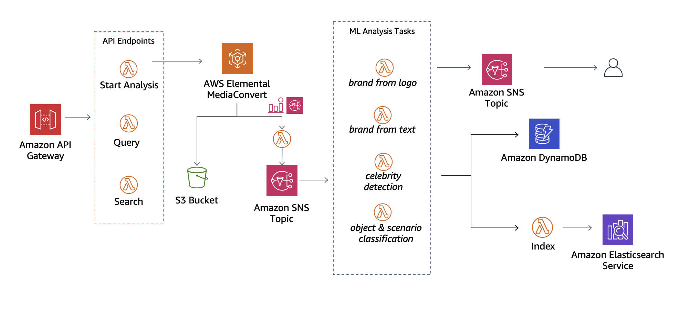

# Media Intelligence Analysis in AWS

Source code for a Media Intelligence Video Analysis solution that can identify specific elements in video content. 
This layer is the basis for identifying and indexing video analysis elements that in the future can be used for finding specific scenes based on a set of rules. 

As possible ad-ons, customers can use this basis layer for:
- Ads Slots identification and insertion as in [Smart Ad Breaks.](https://github.com/aws-samples/aws-smart-ad-breaks)
- Digital Product Placement for branding solutions. 
- Media content moderation
- Media content classification    

## Repository Description

This repository defines the resources and instructions to deploy a _CloudFormation Stack_ on an AWS Account. 

The stack will deploy the following architecture:



## CloudFormation Template Description

The application deploys a REST API with the following endpoints:
- `analysis/start`: Starts a video analysis with the specified parameters
- `analysis/search`: Searches for a video that maches a set of filters
- `analysis`: Retrieves the raw analysis results from _DynamoDB_.

The workflow for a video analysis goes as follows:
1. The user uploads a video to a pre-determined S3 Bucket
2. The user calls the __/analysis/start__ endpoint, starting the analysis workflow
3. Multiple analysis are performed. The results are saved onto DynamoDB and ElasticSearch
4. The user searches for a video using one of the provided filters
5. The user retrieves all the information about an specific video using DynamoDB.

## 1. Installation

Follow these steps in the order to test this application on your AWS Account:

__Prerequisites__

Please install the following applications on your computer if you haven't already:
- [Docker](https://docs.docker.com/get-docker/)
- [Python 3.7](https://www.python.org/downloads/)
- [AWS SAM CLI](https://docs.aws.amazon.com/serverless-application-model/latest/developerguide/serverless-sam-cli-install.html)


### 2. Creating Amazon S3 Bucket(s)

For this prototype we assume that you have two S3 Buckets already created. Troughout this guide we will consider the following:

1. __INPUT_BUCKET__ will hold the video files that will be analysed by the workflow.
2. __OUTPUT_BUCKET__ will receive the files exported by the _MediaConvert_ service.

 Please follow the steps in [this link](https://docs.aws.amazon.com/AmazonS3/latest/userguide/create-bucket-overview.html) and create two S3 bucket if you don't have it already.

### 3. Creating a _Face Collection_ on Rekognition [Optional]

In order to use the Celebrity Recognition Model, you will need to [create a Face Collection on Rekognition](https://docs.aws.amazon.com/rekognition/latest/dg/collections.html) and then index some faces to it.

> You can create the folder `/faces` and generate a list of a few celebrities split by name. You can use it as a starter and follow the instructions on [this link](https://docs.aws.amazon.com/rekognition/latest/dg/add-faces-to-collection-procedure.html) to index them to your face collection. Feel free to use the INPUT_BUCKET you've created before to upload the face images.

Please take note of your face collection Id. We will use it in a next step.

### 4. Training a Custom Labels Model on Rekognition [Optional]

In order for the brand detection algorithm to work, you will need to train a model using _Rekognition Custom Labels_. To do so, please follow the following steps:
1. [Create a Project](https://docs.aws.amazon.com/rekognition/latest/customlabels-dg/cp-create-project.html)
2. Create a folder with some brand logos in `/brands/samples` and then upload them to the __INPUT_BUCKET__.
3. [Create a dataset](https://docs.aws.amazon.com/rekognition/latest/customlabels-dg/cd-manifest-files.html) using the files you uploaded to S3. Inside the `/brands` you will find a file called `output.manifest`.mainfest`. Open that file and replace <__S3_BUCKET__> with the id of the __INPUT_BUCKET__ you used on the previous step.
4. [Train your model](https://docs.aws.amazon.com/rekognition/latest/customlabels-dg/tm-console.html) (This step might take a few minutes to complete.)
5. [Start your model](https://docs.aws.amazon.com/rekognition/latest/customlabels-dg/rm-run-model.html)
 
#### Adding steps 3&4 
If you are willing to implement the __celebrity detection analysis__ as well as the __brand from logo analysis__ you need to create their lambda folders 
inside the `/analysis` folder and create their main source code, you can use as a basis:
- [Searching for a face (Image) in a collection](https://docs.aws.amazon.com/rekognition/latest/dg/search-face-with-image-procedure.html#python)
- [Analysing an Image with Custom Labels](https://docs.aws.amazon.com/rekognition/latest/customlabels-dg/detecting-custom-labels.html)
Additionally to those intermediate steps, you will also need to update the CloudFormation template by adding those analysis, you can use the current analysis as an example. 

[Note] You will need to add these elements in the CloudFormation Template:
- AWS Lambda Function element
- AWS Lambda permissions for each analysis
- Amazon SNS topic subscription for each analysis  

### 5. Configure & Deploy CloudFormation stack

For this step we will need to use a terminal. Please navigate to this folder and run the following commands:

```console
sam build --use-container 
```

```
sam deploy --guided
```

This command will prompt you with a set of parameters, please fill them according to your setup:

| Parameter | Description | Example |
| --------- | ----------- | ------- |
| Email | E-mail to be notified when an analysis completes | my-email@provider.com |
| S3Bucket | The name of the bucket you created previously | INPUT_BUCKET |
| DestinationBucket | The name of the second bucket you created previously | OUTPUT_BUCKET |
| ESDomainName | A unique domain name for the ElasticSearch cluster | my-unique-es-cluster | 
| CognitoDomainName | A unique domain name for the Cognito User Pool | my-unique-cog-cluster |
| DynamoDBTable | A name for the Dynamodb table | aprendiendoaws-ml-mi-jobs |
| CelebrityCollectionID | The Id for the face collection you've created previously | bra-celebs |
| StageName | A name for the stage that will be deployed on API Gateway | Prod |
| OSCDictionary | KEEP DEFAULT | osc_files/dictionary.json |
| ModelVersionArn | The arn of the _Rekognition Custom Labels solution_ you've created previously | arn:aws:rekognition:us-east-1:123456789:project/my-project/verion/my-project |

After filling the values accordingly, use the default configurations until the template starts deploying.

You can visit the _CloudFormation_ tab in the AWS Console to verify the resources created. To do so, click on the __aprendiendoaws-ml-mi__ stack and select the __Resources__ tab.

## API Testing 

__Prerequisites__

Before testing the API be sure you have uploaded a video in the _Amazon S3 Input Bucket_ you defined in the CloudFormation parameters.
You can use one of the videos provided in the `/showcase/examples` folder to perform the testing. To do so, upload the desired video to recently created bucket and call `/start` to start the workflow. You can use the following snippet as an example:

__Start Video Analysis__

Once you have uploaded a video to your Amazon S3 Input Bucket, you must send an HTTPS request to your API with the following body in JSON format:
```json
// #POST /analysis/start
{
  "S3Key": "GranTourTheTick.mp4",    // Your video file name
  "SampleRate": 1,              // The desired sample rate
  "analysis": [                 // The desired analysis
    "osc",
    "bft"
  ]
}
```
__Get Video Analysis Results__
If successfull, you will receive a response containing the Media Convert Job Id and status. Now you can use the `/analysis` endpoint to retrieve the current analysis for that particular job:

```json
// POST /analysis
{
  "S3Key": "GranTourTheTick.mp4",   // Your video file name
  "JobId": "MyJobId",          // The MediaConvert JobId from the previous step
  "analysis": "bfl"            // [OPTIONAL] Which analysis to retrieve results
}
```

__Search Specific Elements in Video Analysis Results__
Finally, you can search your analysis results using the `/analysis/search` endpoint:

```json
// POST /analysis/search
{
  "must":  {                 // [OPTIONAL] Choose what aspects you want in the video
    "scenes": [               // [OPTIONAL] Retrieve videos that these scenes
      {
        "scene": "Sports",
        "accuracy": 50.0
      }
    ]
  },
  "avoid": {
    "sentiments":[                  // [OPTIONAL] Chose the aspects that  
        {                         // you want to avoid in the video
          "sentiment": "sadness",
          "accuracy": 89.0
        }
    ]
  },
  "S3Key": "GranTourTheTick.mp4", // [OPTIONAL] Choose a video search the results
  "SampleRate": 1            // [OPTIONAL] Choose a sample rate to search the results
}
```

## Development Team

This prototype developed by the AWS Envision Engineering Team. For questions, comments, or concerns please reach out to:

- __Technical Leader__: [Pedro Pimentel](mailto:pppimen@amazon.com)
- __EE Engineer__: [Arturo Minor](mailto:arbahena@amazon.com)
